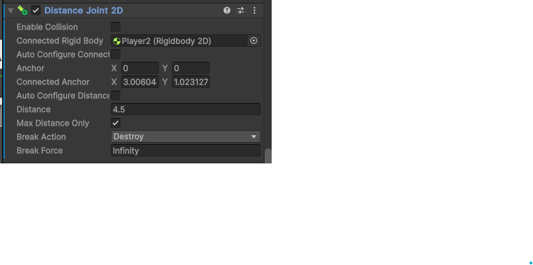
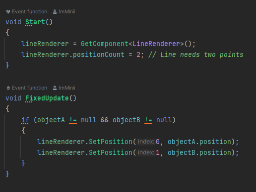
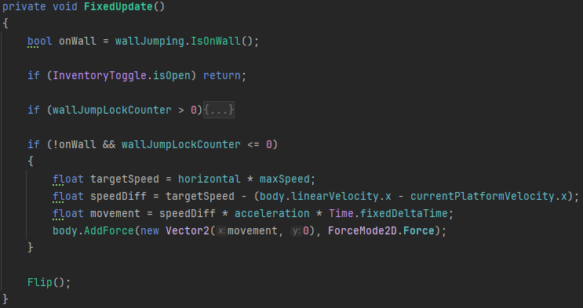

# BlogPost 3 - First Milestone

This game started out with focus on the foundational functions. Since we were 2 people working on the game, the unity project was set up to have 2 different scenes.. This way we could both focus on different features and push with no conflicts.

### Co-op

Since this game was a co-op game we should figure out how two players could play, but also how they should be linked together. We started out trying using the player input manager with the new input system. By using that the players would spawn in when a button is clicked. This became problematic when the second player spawned in because they would not be linked together. This should be a script that would automatically connect them, but it seemed like this would pose some bugs in the long run. Instead both players are instantiated from the start. This way the players could be linked from the start and didn’t require a script.

### Rope
Connecting the players can be done differently. In this game it’s done with the DistanceJoint2D component. We tried using Hinge and SpringJoint2D. While the HingeJoint was an option to also visually simulate a rope, the way we implemented it quickly became janky and unrealistic. The rope would float and behave very weird. The SpringJoint was a good option but it didn’t feel like a rope, funnily enough it was too bouncy. The Distance Joint was best to have because it felt like a rope. Only player 1 has this component and is connected to player 2. The visuals of the connection of the 2 players is done with LineRenderer and a simple script. It is a simple solution so it’s just a direct line. Creating a script that simulated a rope seemed complicated and is something that could be worked on later.

### Physics

Having implemented the rope the physics became unrealistic and weird. The hanging player didn’t swing whatsoever and stopped before reaching the bottom. The player could almost have full control of the swing. The reason why this happened was the movement was based on velocity:

_body.linearVelocity = new Vector2(horizontal \* speed, body.linearVelocity.y);_

By having this the physics/movement didn’t preserve the momentum. Instead we had to change the movement to be based on acceleration and momentum:

By having this the player has a max speed but players accelerate up to the max speed, by calculating the current speed with the acceleration. This is also calculated when the player swings so the game is able to calculate the momentum.

### Camera movement

As the players moves around the camera will snap to a new position when both players leave the current camera's field of view. This works as the camera takes the players position and the camera height and width to determine where the players are on the screen. If the players both leave the camera will then be moved with either its height or width in the direction the players are going. The use of Mathf.Clamp to change the position, makes it so there is a limit to the bounds the camera will move before it won’t snap to a new position. With the scope of the game there is a restraint to how big the map will be, which means the bounds for the camera won’t be a constraint for when the game is further along in its development.