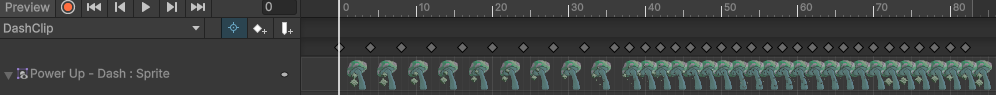

# BlogPost 5 - Last Milestone

With the majority of the features now done we moved on to making the game more aesthetically pleasing and making a level that showcases the different features that were implemented. A thing we also added were the collectables to make an incentive for the players to explore the world to find these collectables, which are gems.

### Collectables

The collectables are very simple as they can only be collected. The number of collected gems are shown in a UI where it also states how many gems there are in the world. To make it more clear that the players can pick them up, they are animated. The animation is not just on the sprite but also on a spotlight so it looks like the collectables have a glowing pulse around it. There is also a sound for when one of the players collide/pick-up with a collectable to make it more clear that the gem was collected.

The power-ups also have the same type of animation as the gems with the spotlight but made slightly different. There is a difference in the speed for the animation on some of the power-ups to make it more intriguing and not as uniformed.

The dash powerup is the one where it is the clearest to see that the animation is not at a constant speed. Each power-up has a similar set up also with the light that lumineate like the gems. The power-ups also have a sound when picked-up that is different from the gems to make the difference more obvious. All the power-ups have the same sound when they are collected.

### World building

We then moved onto the creation of the world. The world itself is made with different layers that are intractable for the players. These special layers are the Ground, Wall and BushWall that have more functional features than other layers which are purely aesthetic. The BushWall is used for the phase power-up to make it inaccessible except if the player has the power-up active. The game is also a platformer so the worldbuild is an important part of the game creation. There are different areas that are unlocked as the player gathers power-ups. The last parts of the game that were added to the map was to make it more pleasing to play, by adding non interactable aesthetic objects and some background music that starts when playing the game.